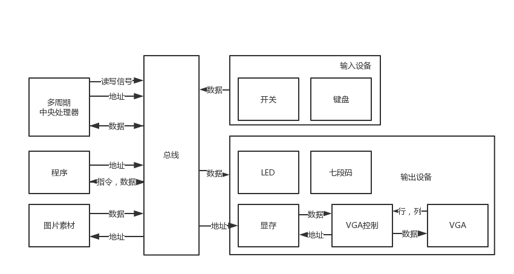
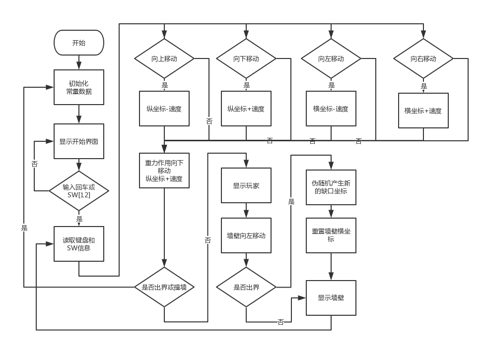

# FPGA MIPS-based CPU APP Flappy Bird

Project for computer organization course, implementing a simple popular game **flappy bird** in FPGA. It takes me one week to learn about the bus, VRAM, and write the program.

----

## System Organization

The system is logically divided into two parts: **hardware (three base parts of computer: IO, CPU, memory)** and **software (assemble game flappy bird based on MIPS)**.

### Hardware

The hardware environment is built step by step during 13 exps. After that, to enable the player to interact with the computer, I add some extra modules and functions. 

Simply speaking, there are five major modules: input, output, control, data path, and memory. 

- **Input**: Enable to input data through PS/2 keyboard or buttons, switches.

- **Output**: Enable to output info into 7-segs, 640x480 monitor, LEDs.

- **Control & Data Path**: Decode and implement instructions, including add, sub, or, xor, nor, and, slt, addi, ori, xori, nori, lw, sw, beq, bne, slti, j, jal, jr, jalr, lui, sll.

- **Memory**: Store assemble program, and pictures.

### Software
Based on supported instructions above, an assemble program is written to run flappy bird. 

----

## How To Use
You can directly use the project file in folder `ISEproject` or build a new project with folder `modules` and `coe`.

In `modules` are all hardware modules. Most of them are in Verilog HDL and you can modify them freely, while some are hard cores involved in IO function.

Files in `coe` are initialization file for RAM. Some pictures can be found in folder `picture`. The original assemble program is `flappybird_final.asm`. If you already have built a hardware project, you can write your own application like tank war or whatever else by easily changing `coe`s.

----
## Performace
Only support single player. The player can manipulate the bird by switches or keyboard. The score is displayed in 7-segs.

There is a screen flicker problem when playing since I first draw all four pillars and then erase pixels to make each gap. I didn't fix this problem since it doesn't affect the game much, and its solution is complex.