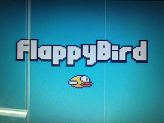

# FPGA MIPS-based CPU APP Flappy Bird
Project for computer organization and design course, implementing a simple popular game **flappy bird** in FPGA. It takes me one week to learn about bus, VRAM and write program and I've learned a lot.

----

### System Organization

The system is logically divided into two parts: **hardware (three base parts of computer: IO, CPU, memory)** and **software (assemble game flappy bird based on MIPS)**.

#### Hardware

The hardware environment is built step by step during 13 exps. However, in order to meet interaction needs of this game, some extra modules and functions have been added. 

Simply speaking, there are five major modules: input, output, control, data path and memory. 

- **Input**: enable to input data through *keyboard*, buttons, switches
  Keyboard is based on PS/2.

- **Output**: enable to output info into 7-segs, *monitor*, LEDs

  Monitor is 640x480.

- **Control & Data Path**: decode and implement instructions 

  Instructions have been implemented by now are listed below: add, sub, or, xor, nor, and, slt, addi, ori, xori, nori, lw, sw, beq, bne, slti, j, jal, jr, jalr, lui, sll

- **Memory**: store assemble program, *pictures*, or be used as *VRAM*.

#### Software
Based on supported instructions above, an assemble program is written to run flappy bird. 

----

#### Build project
You can directly use project file in folder `ISEproject` or build new project with folder `modules` and `coe`.

In `modules` are all hardware modules. Most of them are in Verilog HDL and you can modify them free, while some are hard cores involved in IO function.

In `coe` are initlization file for RAM. Some pictures can be find at folder `picture` and original assemble program is `flappybird_final.asm`. If you already have built a hardware project, you can write you own application like tank war or whatever else by easily changing coes.

----
### Performace
Only support single player. Player can manipulate bird by switches or keyboard. Score is displayed in 7-segs.

There is a splash screen problem when playing since I write all four pillars and then erase pixels to process openings. I haven't change the algorithm because otherwise it will be much more complex and believe current process method is enough.

